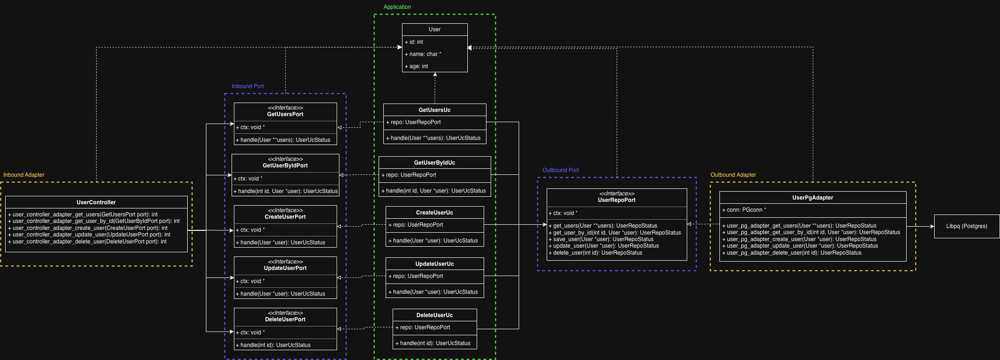

# Lab API em C

Playground para experimentar um CRUD de usuários em C usando Ulfius (HTTP), Jansson (JSON) e PostgreSQL. Além de exercitar o uso dessas ferramentas, a ideia desse projeto é estudar a fundo como utilizar algumas técnicas na linguagem C, como polimorfismo, inversão de depêndencias e isolamento de camadas. Para isso, optei por construir o projeto usando arquitetura hexagonal (ports and adapters), conforme o diagrama abaixo:



Note que estou utilizando a simbologia UML para classes e interfaces por convêniencia e para facilitar o entendimento do leitor. No caso, as "classes" nada mais são do que um conjunto de `struct` (representam as variáveis de estado) + funções (representam os métodos) e as "interfaces" são `structs` que recebem um ponteiro opaco `*ctx` (equivalente ao parâmetro `this`) e diversos ponteiros de funções (que representam os métodos abstratos da interface). Também por conveniência, considerei como nome das "classes" e "interfaces" o nome dos `structs` correspondentes.

## Pré-requisitos

- GCC, `make` e `pkg-config`
- Bibliotecas de desenvolvimento: `libulfius`, `liborcania`, `libjansson`, `libpq`
- Docker + Docker Compose (para subir o banco e rodar testes de integração)

## Banco de dados

1. Suba o PostgreSQL local com as credenciais esperadas pela aplicação:
   ```sh
   docker compose up -d database
   ```
   - Host: `localhost:5432`
   - Usuário: `teste` | Senha: `teste123` | Banco: `testedb`
2. Crie a tabela usada pelo serviço (não há migrações automáticas):
   ```sql
   CREATE TABLE IF NOT EXISTS users (
     id INT GENERATED ALWAYS AS IDENTITY PRIMARY KEY,
     name VARCHAR(255),
     age INT
   );
   ```

## Build e execução

Com o banco ativo:

```sh
make          # compila em build/lab_api
make run      # inicia o servidor em http://localhost:8080
```

Use `make clean` para remover artefatos de build.

## Endpoints

Prefixo: `/api/v1`

- `GET /users` → 200 com `{ count, users[] }` ou 204 se vazio.
- `GET /users/:id` → 200 com usuário ou 204 se não existir.
- `POST /users` → 201. Corpo: `{"name":"Fulano","age":30}`
- `PUT /users` → 200 ao atualizar, 204 se id não encontrado. Corpo: `{"id":1,"name":"Novo Nome","age":31}`
- `DELETE /users/:id` → 200 ao remover, 204 se id não encontrado.
- Erros de banco retornam 500.

Exemplos rápidos:

```sh
curl -X POST http://localhost:8080/api/v1/users \
  -H "Content-Type: application/json" \
  -d '{"name":"Alice","age":25}'

curl http://localhost:8080/api/v1/users

curl -X PUT http://localhost:8080/api/v1/users \
  -H "Content-Type: application/json" \
  -d '{"id":1,"name":"Alice Souza","age":26}'
```

## Testes

- Unitários (Unity): `make tests`
- Integração (PostgreSQL via Compose): `make itests`
  - O `make itests` sobe o banco definido em `tests/integration/docker-compose.yaml` na porta 5432; pare qualquer outro PostgreSQL na mesma porta antes de rodar.
- Carga (K6): `make ltests`\*
  - O teste de carga está configurado para testar a performance do endpoint /api/v1/users/{id} sob a carga de 1000 rps durante 5 minutos. Nessas condições, checam-se a latência p(99) e o error rate.
  * \*Obs: Necessário executar com a API rodando em localhost:8080
